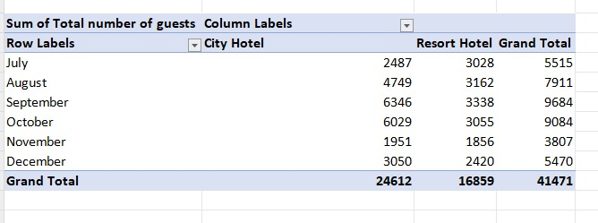
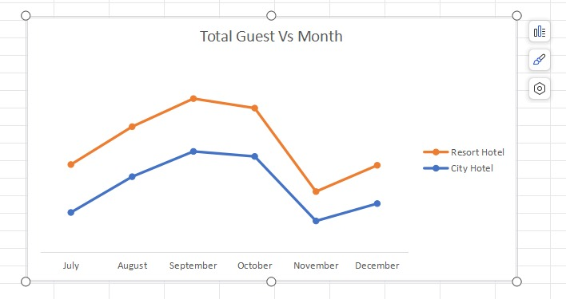
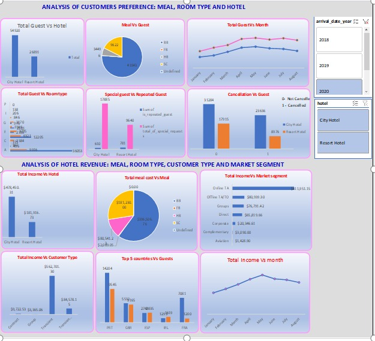

## HOTEL REVENUE
This is a repository to test my knowledge.

# Introduction

I am committed to elevating my career as a data analyst by mastering predictive, prescriptive, and cognitive analysis alongside descriptive and diagnostic analytics. I have recently registered for the Dahel Techies Data Analytics Program to enhance my skill set. One of the group projects I significantly contributed to was the analysis of the Hotel revenue dataset.

The purpose of this report is to provide valuable insights and data-driven recommendations for City and Resort Hotel, as contained in the Hotel Revenue dataset. This report has been meticulously prepared to address key business questions and challenges faced by the hotels and leverage data analysis to support informed decision-making and enhance overall business performance.

## Problem Statement

To identify and understand the factors influencing Hotel Revenue performance, the analysis objective is
- To gain insights and spot patterns and trends present in the data
- To evaluate historical revenue trends and key Performance Indicators (KPIs).
- To provide insights for  data-driven decision-making  for the profitability of the hotel operations
- Lastly, to design a dashboard that would communicate information and subsequent year projections

## Skills and concepts demonstrated:

**Advanced Excel** is the skill applied. 
Other skills demonstrated included
- Creating calculated fields
- Forecasting on Excel charts
- Data analysis
- Visualization using advanced Excel techniques

## Data Source

The dataset was provided by Dahel Techies Consultants in form of a “csv file” and it consists  of 141586 rows and 35 columns.

## Data Cleaning and Transformation

The data dictionary was provided by Dahel Techies. It indicates that various transformations or forecasting need to be performed. To understand the data and remove ambiguity, we cleaned the datasets with a Power Query editor. After the cleaning, the unified table was loaded into Excel for visualization and insight generation. Pivot tables were inserted, and slicers and filters were applied. Multiple queries were used to analyze the data. You will find the tables below:

**Pivot tables**                                                          | **Charts**
:-----------------------------------------------------------------------:|:---------------------------------------------------------------:
                                                                    | 
                                                                                          
## Data Analysis and Visualization

We wanted to create a dashboard with the ability to float, allowing us to align my KPIs effectively. We ended up creating 12 views and a dashboard. Here is the dashboard.

## INSIGHTS AND RECOMMENDATIONS

It is important to highlight that, for the years 2018, 2019, and 2020, customers preferred Bed and Breakfast (BB) at both hotels. In the City Hotel, the numbers for BB were 19,970, 79,781, and 41,843, and in the Resort Hotel, the numbers were 19,561, 12,101, and 40427. In contrast, Full Board (FB) had the lowest order in the City hotel, and Self-Catering had the lowest order in the Resort hotel. This indicates that guests preferred eating breakfast at the hotels compared to other available meal options.
The market segments Online TA, Groups, and Offline TA/TO categories brought in the most money for the City Hotel, while the Resort Hotel's Online TA, Direct, and Offline TA/TO categories fared well financially during the years under review. Aviation and Complementary market segments performed insignificantly, suggesting a need for a market survey.
Out of all the client type categories, Transient and Transient Party generated the highest income during the reviewed years. Direct, group, and contract categories performed poorly, indicating the need for further assessment. Both hotels experienced a rise in revenue from August to October 2018, with a subsequent decrease in earnings. There was an improvement in 2019 until November, after which the income began to decline and continued to do so until the end of the 2020 fiscal year.
Throughout the three years under examination, the City hotel had the most guests—24,612 in 2018, 99,377 in 2019, and 54,920 in 2020, respectively. The Type A assigned room had the greatest number of guests. Hence it is advised that:
- Hotels concentrate on more profitable ways to advertise, thereby creating awareness and increasing sales.
- Price list examination should be taken into consideration, ensuring customers receive value and great service for every patronage. 
- The marketing division should focus on presenting the hotel in a favourable light.
- To market its services more effectively, the company needs to roll out new Customer-centered features and strategies.
-  Marketing campaigns showcasing the hotel's selling points would be beneficial.
-  The catering department should take pride in producing tasty meals and
- Monthly training and incentives would enhance staff effectiveness and commitment to rendering premium services.
  
## CONCLUSION

Over the years 2018, 2019, and 2020, visitors continuously preferred Bed and Breakfast choices. A review of market segmentation shows that the City Hotel benefits from online TA, Groups, and Offline TA/TO, while the Resort Hotel gains from online TA, direct reservation, and offline TA/TO. The customer types that generated the highest revenue were Transient and Transient Party, indicating that Group and contract categories require more assessment. However, the revenue trends show an upswing and downswing, which necessitates consistent marketing campaigns and pricing modifications to attract and retain customers. To further increase guests’ satisfaction, culinary excellence and staff training should be the focus.

**Thank you for your time. I am actively seeking an entry-level Data Analyst role and am eager to engage in a discussion about your company and industry.**

