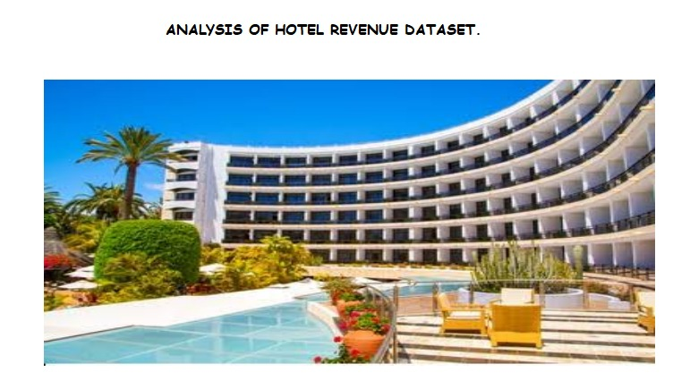

## HOTEL REVENUE
This is a repository to test my knowledge.

# Introduction

I am committed to elevating my career as a data analyst by mastering predictive, prescriptive, and cognitive analysis alongside descriptive and diagnostic analytics. I have recently registered for the Dahel Techies Data Analytics Program to enhance my skill set. One of the group projects I significantly contributed to was the analysis of the Hotel revenue dataset.

The purpose of this report is to provide valuable insights and data-driven recommendations for City and Resort Hotel, as contained in the Hotel Revenue dataset. This report has been meticulously prepared to address key business questions and challenges faced by the hotels and leverage data analysis to support informed decision-making and enhance overall business performance.

## Problem Statement

To identify and understand the factors influencing Hotel Revenue performance, the analysis objective is
- To gain insights and spot patterns and trends present in the data
- To evaluate historical revenue trends and key Performance Indicators (KPIs).
- To provide insights for  data-driven decision-making  for the profitability of the hotel operations
- Lastly, to design a dashboard that would communicate information and subsequent year projections

## Skills and concepts demonstrated:

**Advanced Excel** is the skill applied. 
Other skills demonstrated included
- Creating calculated fields
- Forecasting on Excel charts
- Data analysis
- Visualization using advanced Excel techniques

## Data Source

The dataset was provided by Dahel Techies Consultants in form of a “csv file” and it consists  of 141586 rows and 35 columns.

## Data Cleaning and Transformation

The data dictionary was provided by Dahel Techies. It indicates that various transformations or forecasting need to be performed. To understand the data and remove ambiguity, we cleaned the datasets with a Power Query editor. After the cleaning, the unified table was loaded into Excel for visualization and insight generation. Pivot tables were inserted, and slicers and filters were applied. Multiple queries were used to analyze the data. You will find the tables below:

**Pivot table**                                                          | **Chart**
:-----------------------------------------------------------------------:|:---------------------------------------------------------------:
                                                                    | 

